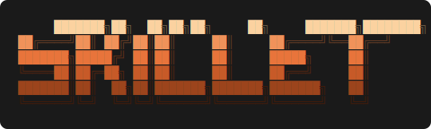

<p align="center">
  
</p>

<p align="center">
  <a href="https://github.com/dafrick/skillet/actions/workflows/ci.yml"></a>
  <a href="https://www.npmjs.com/package/@skillet-cli/core"></a>
  <a href="https://www.npmjs.com/package/@skillet-cli/core"></a>
  
</p>

<p align="center"><em>Mise en place for your agents.</em></p>

## What is Skillet?

Skills are structured files that teach AI agents how to accomplish specific tasks. Getting them installed across different agent environments — Claude Code, GitHub Copilot, generic agents — requires detecting the right tool, resolving the right path, handling updates, and presenting a consistent experience. Every skill author would have to build that from scratch.

Skillet solves this once. Authors publish a small CLI powered by `@skillet-cli/core`; end users run it to install, update, and manage skills in their agent environment.

## Design Principles

- **One dependency ships a complete installer.** Add `@skillet-cli/core` to your package, call `run()`. The CLI, prompts, adapters, drift detection, and UX are all included. Nothing else to wire up.
- **npm is the distribution layer.** Skills ship as npm packages. Skillet adds an installer, not a new registry or distribution channel. Your existing publish workflow is enough.
- **UX is skillet's job, not yours.** Scope selection, auto-detection of agent environments, drift detection, update prompts, rich terminal output — everything that makes an installer feel polished comes out of the box. Write great skills; let skillet handle the rest.
- **Broad reach that expands over time.** Skillet ships with adapters for Claude Code, GitHub Copilot, and generic agents. As the ecosystem grows, so does adapter support — without changes to your skill.

## Using Skillet

When you install a skill published with `@skillet-cli/core`, you get four commands:

```sh
my-skill install     # Install the skill into detected agent environments
my-skill update      # Update an installed skill, preserving local modifications
my-skill list        # Show installed locations and drift status
my-skill uninstall   # Remove the skill from selected locations
```

**Scopes** — skills install at two granularities:

- `user` — installs to your home directory; available across every project
- `project` — installs to the current directory; scoped to that repo

The installer detects which agent tools are present and pre-selects them. You can confirm the defaults or choose a different target.

## Building with @skillet-cli/core

Install the package:

```sh
npm install @skillet-cli/core
```

Create an entry point — this is the entire CLI:

```js
#!/usr/bin/env node
import { createRequire } from 'node:module';
import { run } from '@skillet-cli/core';

const pkg = createRequire(import.meta.url)('../package.json');
await run({ skillDir: new URL('../skill', import.meta.url).pathname, pkg });
```

Add a `"bin"` field to your `package.json` pointing to that file, publish to npm, and you're done. Skillet handles detection, prompts, install, update, drift, and uninstall for every supported agent environment.

### RunOptions

| Option | Type | Description |
|---|---|---|
| `skillDir` | `string` | Path to the directory containing your skill files |
| `pkg` | `{ name, version }` | Your package's name and version (for the update notifier) |
| `hooks.transform` | `(skill) => skill` | Modify the normalized skill before adapter dispatch |
| `hooks.beforeInstall` | `(skill, adapter, ctx) => void` | Run before each install |
| `hooks.afterInstall` | `(skill, adapter, ctx) => void` | Run after each install |
| `hooks.extendProgram` | `(program, ctx) => void` | Add custom subcommands to the CLI |

## Contributing

See [CONTRIBUTING.md](CONTRIBUTING.md) for dev setup, scripts, commit format, and the release process.
